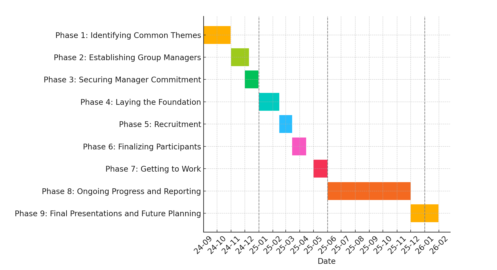

This is an iterable approach to organizing and managing the many community-driven initiatives important to the DevRel Profession. This process is designed to ensure that the DevRel Foundation isn’t led by the assumptions of the steering committee as to what the important topics to tackle are but instead charged with the stewardship of collecting input, creating processes to organize that data, and shepherding solutions to real problems. Embedding flexibility and iteration ensures continuous growth and adaptation to meet the community's evolving needs.

### **Phase 1: Identifying Common Themes** (September-October)

- Gather key themes that matter to the community through [surveys](https://docs.google.com/forms/d/e/1FAIpQLSd1_z1JP7VTOAt6FQBcG7iwHSXFX6JbgRnVtk7WuVBBAMXHmg/viewform), [office hours](https://discord.com/channels/1255563562449899573/1255564735009656964), [Discord](https://discord.gg/Vc6Qytc9vE), [GitHub Discussions](https://github.com/DevRel-Foundation/governance/discussions), and other [community conversations](challenges.md). (Submission Deadline October 4, 2024)
- Announce this initial list of key themes to the participants and the public via GitHub with the option for the community to add more suggestions. (Submission Deadline October 21, 2024)
- Finally, the steering committee will be able to add additional themes to complete the list. (Publishing Deadline October 31, 2024)
### **Phase 2: Establishing Group Managers** (Estimated Start November 2024)

- Round 1 - Using the final list of key themes from Phase 1, volunteers from the community will opt-in to manage the group responsible for a theme. (Duration: 10 Days)
	- Limit of 1 group selection per person.
	- Minimum of 2 hours per week commitment. 
	- Minimum of 6 months commitment.
	- Minimum of 3 managers for each group.    
- Round 2 - The total number of managers for each theme is made public. Groups with under 3 managers will be labeled “At Risk.” Managers can move to another group or stick with their initial suggestion. Volunteers who didn’t participate in Round 1 still can join in Round 2. (Duration: 1 Week)
	- Limit of 1 group selection per person.
	- Minimum of 2 hours per week commitment.
	- Minimum of 6 months commitment.
	- Minimum of 3 managers for each group.
	- Selections are final.
### **Phase 3: Securing Manager Commitment** (Estimated Start December 2024)

- Groups that meet the minimum threshold of managers will move to this Phase.    
- Managers provide information and sign commitment forms that outline the expectations for their roles. (Duration: 1 Week) 
	- Minimum of 2 hours per week commitment.
	- Minimum of 6 months commitment.
	- Agree to the Code of Conduct.
	- Agree to governing document.
	- Agree to make their name public.
	- Provide bio, management experience, and the reasons why they chose their theme.
- The steering committee will review the information. (Duration: 10 Days)
	- Managers who have not completed the required information will be removed and notified.
	- Managers who do not have experience in the theme will be removed and notified.
	- Groups not related to DevRel will be removed and notified.
	- Groups that have less than 3 managers will be removed and notified.    
- Managers and Groups removed may file an appeal. (Duration: 5 Days)
	- A majority of the steering committee must vote to overturn an appeal.
### **Phase 4: Laying the Foundation** (Estimated Start January or February 2025)

- Managers added to tools. (Duration: 5 Days)
	- Managers will be added to the [group]-managers@lists.dev-rel.org distribution list.
	- Managers will be added to the #[group] channel on the DevRel Foundation Discord instance.
	- Managers will be added to the [group] repo on the DevRel Foundation GitHub.
- Creation of Group Charter (Duration: 2 Weeks)
	- Write a well-defined mission statement for the group for the 6 month period.
	- Define the leadership structure for the group.
		- How are decisions made?
		- How will participants be included in decisions?
		- Who is responsible for what tasks?
	- Estimate what resources and personnel are needed to accomplish the mission statement.
	- How often and when will the group meet?
	- All managers must hold a consensus vote to agree on the charter.
- Feedback and approval from the steering committee. (Duration: 1 Week)
	- Groups that do not receive approval will be removed and notified.
	- This decision can not be appealed.
### **Phase 5: Recruitment** (Estimated Start February or March 2025)

- Each Group’s Charter and the list of managers will be made public.
- Recruitment drive for participants to the group. (Duration: 2 Weeks)
	- Group managers create the application form for participants.
	- The steering committee will promote the recruitment process.
	- Group managers are encouraged to promote the recruitment process.
	- Each group must receive a minimum of 8 participants.
### **Phase 6: Finalizing Participation** (Estimated Start March or April 2025)

- Groups will select their participants. (Duration: 2 Weeks)
	- Participants must confirm their participation in the group.
	- Participants are limited to participate in a maximum of 2 groups.
- Group managers hold a consensus vote to move forward. (Duration: 3 Days)
### **Phase 7: Getting to Work** (Estimated Start May 2025)

- Participants added to tools. (Duration: 5 Days)
	- Participants will be added to the [group]-participants@lists.dev-rel.org distribution list.
	- Participants will be added to the #[group] channel on the DevRel Foundation Discord instance.
- Hold initial group meeting/orientation. (Within: 2 Weeks)
	- Introductions and Q&A.
- Group documentation creation. (Duration: 2 Weeks)
	- Define the goals of the final deliverable after the 6 month period.
	- Create a timeline with significant milestones.
	- Assign roles for participants if needed.
- Submit documentation to the steering committee.
	- These documents will be made public.
### **Phase 8: Ongoing Progress and Reporting** (Estimated Start June 2025)

- At least 1 group manager must present their progress at 1 of the DevRel Foundation open meetings every month.
	- Progress against their timeline.
	- Lessons learned.
	- Request additional resources.
	- Estimate of work that will be completed before the next check-in period.
	- Announce any significant changes to the group charter or deliverable.
### **Phase 9: Final Presentations and Future Planning** (Estimated Start December 2025 or January 2026)

- At the conclusion of the commitment period, there will be a final presentation at an open meeting. (Within: 1 Month)
	- Deliverables published to GitHub.
	- Wrap-up summary of lessons learned published to GitHub.
	- Recommendations to pass on to the next group published to GitHub.
	- Feedback on the overall process published to GitHub.
	- Optional recognition of group managers or participants.
	- Indication of what managers and participants would continue for another commitment period and in what capacity.
### **Conclusion: Continuous Improvement**

As we complete all phases, the steering committee will review the entire process. This final step is essential for ongoing growth and adaptability. We may revisit Phase 1 for new ideas and feedback to keep our community dynamic and aligned with its goals.

We value your input on the duration and effectiveness of each phase to balance thoroughness and efficiency. Your feedback will help us refine our approach and ensure impactful, meaningful collaboration.

Together, we can foster a thriving community where everyone has the opportunity to succeed.

